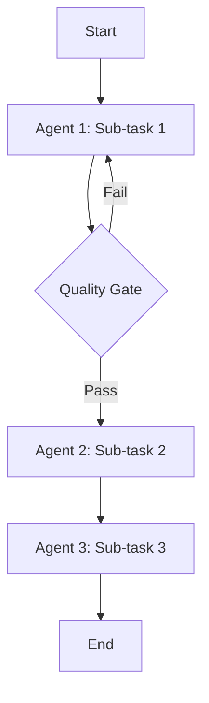

# Multi-Agent Orchestration

## Objective

Design a multi-agent orchestration system that coordinates multiple specialized AI agents to complete complex tasks. Define agent roles, communication protocols, delegation patterns, conflict resolution, and workflow sequencing for efficient collaborative AI operations.

## Pre-Conditions

- Complex task requiring multiple expertise domains identified
- Individual agent personas defined (or to be created via agent-persona-creation task)
- Orchestration framework or tool available (Claude Code subagents, custom orchestration)
- Success criteria for the orchestrated workflow defined
- Context budget and performance constraints established

## Steps

1. **Decompose the Task** — Break the complex task into sub-tasks that map to agent expertise domains. Each sub-task must have: clear input, clear output, single responsible agent, and defined completion criteria. Identify dependencies between sub-tasks.
2. **Assign Agent Roles** — Map each sub-task to the most appropriate agent based on expertise. Identify the orchestrator agent responsible for coordinating the overall workflow. Ensure no agent is overloaded (max 3-4 sub-tasks per agent).
3. **Design Communication Protocol** — Define how agents communicate: handoff format (structured YAML artifact with context, decisions, files modified), message passing rules (what to include, what to omit), and escalation paths (when an agent cannot complete its sub-task).
4. **Build Delegation Matrix** — Create a matrix showing: which agent can delegate to which, what operations are exclusive to each agent, what requires orchestrator approval, and what can be done autonomously. Reference the agent-authority rules.
5. **Design Workflow Sequencing** — Map the execution order: which sub-tasks run sequentially (output of one feeds input of next), which run in parallel (independent sub-tasks), and which are conditional (only run if previous sub-task produces certain output). Create a workflow diagram.
6. **Implement Context Compaction** — Design how context is managed across agent switches: use the agent-handoff protocol to compact outgoing agent context (~379 tokens), load incoming agent's full persona, and preserve critical state (story ID, branch, decisions). Target < 500 token overhead per switch.
7. **Create Conflict Resolution Protocol** — Define how conflicts between agents are resolved: expertise conflicts (two agents claim authority), resource conflicts (agents need the same file), decision conflicts (agents disagree on approach). Escalation hierarchy: peer negotiation -> orchestrator mediation -> human decision.
8. **Design Quality Gates** — Place quality checkpoints between agent transitions: output validation (does the output meet the receiving agent's input requirements?), completeness check (are all required fields present?), and consistency check (does the output align with previous decisions?).
9. **Implement Monitoring and Logging** — Design the orchestration log: which agent is active, what sub-task is being executed, time spent per sub-task, handoff events, and escalation events. Enable debugging of orchestration failures.
10. **Test the Orchestration** — Execute the full orchestrated workflow end-to-end: verify each agent transition preserves necessary context, verify quality gates catch invalid outputs, verify conflict resolution works, and measure total execution time vs. single-agent execution.
11. **Create Orchestration Template** — Package the orchestration design as a reusable template: workflow definition, agent assignments, communication protocol, and configuration. Enable teams to adapt the template for similar complex tasks.

## Output

```markdown
# Multi-Agent Orchestration Design

## Task Decomposition
| Sub-Task | Agent | Input | Output | Dependencies |
|----------|-------|-------|--------|-------------|

## Delegation Matrix
| Agent | Can Delegate To | Exclusive Operations |
|-------|----------------|---------------------|

## Workflow Sequence


## Communication Protocol
### Handoff Format
```yaml
handoff:
  from_agent: "{agent}"
  to_agent: "{agent}"
  context: "{summary}"
  decisions: ["{decision}"]
  files_modified: ["{file}"]
  next_action: "{action}"
```

## Conflict Resolution
| Conflict Type | Resolution | Escalation |
|--------------|-----------|-----------|

## Quality Gates
| Gate | Between | Checks | Pass Criteria |
|------|---------|--------|--------------|

## Monitoring
- Log location: {path}
- Metrics tracked: {list}
```

## Quality Criteria

- Every sub-task must have exactly one responsible agent (no ambiguity)
- Context compaction must keep handoff overhead under 500 tokens per transition
- Quality gates must catch at least 90% of invalid outputs before they reach the next agent
- Conflict resolution must handle all three conflict types with documented procedures
- End-to-end orchestration must complete within 2x the time of the longest sequential path
- Orchestration template must be reusable for at least 2 different task types
